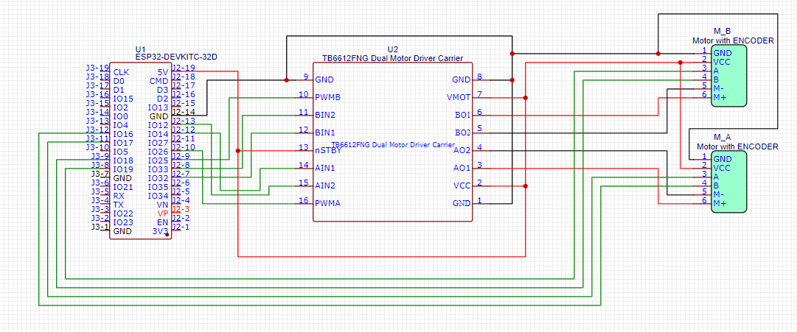

# Navros
Differential Drive Robot for Data Collection and UI Design
## Components
- 2x N20 DC Motors
- TB6612FNG Dual Motor Driver
- ESP32
- Rasperry Pi 5
- 2x Wheels
- 3D Printed Chassis

## ROS2 Nodes
Read data from these nodes to be displayed on the Web UI
1. MicroRos
**Sub to this Topic : navros_motor_control **
**Sub to this Topic : navros_motor_feedback **
   - Node running on the ESP32
   - Control the 2 N20 DC Motors
3. YOLOV8 OpenCV Cone Detection
- **To access quadrant data**:
   - Sub to this Topic: **'/cone_detection/quadrant'**
- **To access Video Stream**:
   - Sub to this Topic: **'/cone_detection/image'**
- Cone Detection Model
- Obstacle Avoidance and corrective measures

5. Keyboard Controller
- Sub to this Topic: **/diff_cont/cmd_vel_unstamped**
- Control navros using keyboard

  # Circuit Diagram
  

# Run the newer version of Navros:
- **Keyboard Control**
```
ros2 run teleop_twist_keyboard teleop_twist_keyboard --ros-args -r /cmd_vel:=/diff_cont/cmd_vel_unstamped
```
- **Run the complete Gazebo + MicroRos Setup**
```
ros2 launch navros_bringup navros_drive.launch.xml 
```
- **Cone Detection Model**
```
ros2 run navros_opencv navros_test2_opencv.py
```

## Gazebo + Real Robot Simulation using Keyboard Control - NavRos
### Console 1
- Run Gazebo Sim + Real Robot
```
ros2 launch navros_bringup navros_drive.launch.xml
```
- navros_robot_controller_server.py 
  - Containts the service - navros_vel_server // Recieve directional values and implement them on the motors using piserial and arduin0
- robot state publisher
- gazebo_ros
- rviz2
- spwaer - /diff_cont
- spawner - /joint_broad


# Key Topics and Services
- navros_vel_server
  - send values to arduino via piserial
  - use the navros_vel_sub_client.py to send values to arduino via the navros_vel_server
- /diff_cont/cmd_vel_unstamped
  - Read the linear and angular values that are being sent to the real robot

### Console 2
- Navros Keyboard Control
```
ros2 run teleop_twist_keyboard teleop_twist_keyboard --ros-args -r /cmd_vel:=/diff_cont/cmd_vel_unstamped
```
### Console 3
- Send control requests to navros_vel_server to communicate using ROS-Arduino Bridge
```
ros2 run navros_remote navros_vel_sub_client.py 
```
### Subscriber to Read values from the DC Motor Encoder
```
ros2 run navros_remote navros_encoder_sub.py
```
